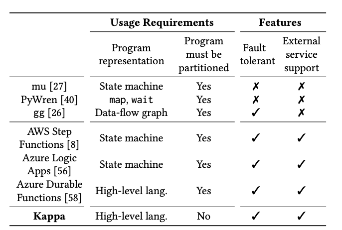
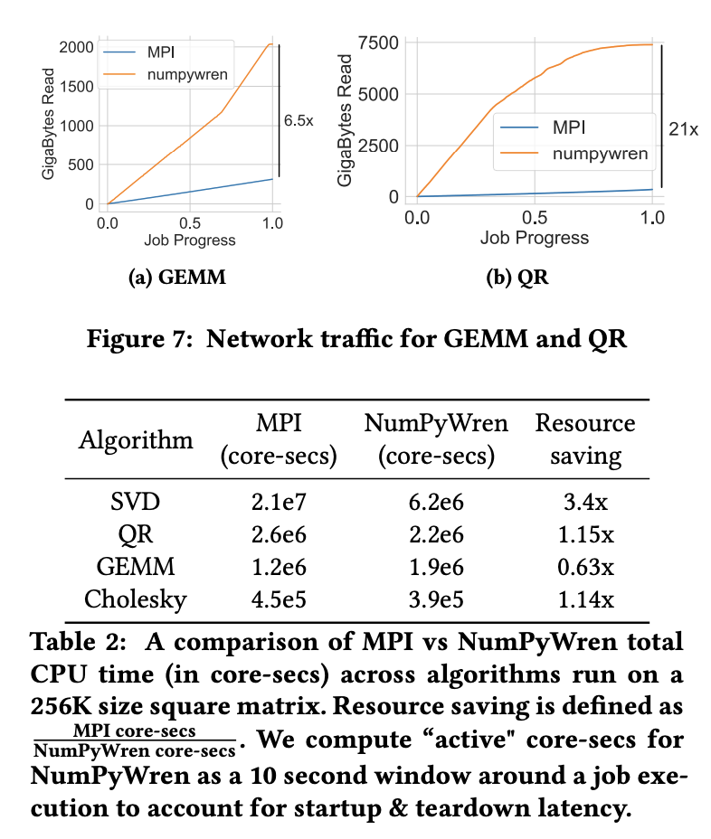
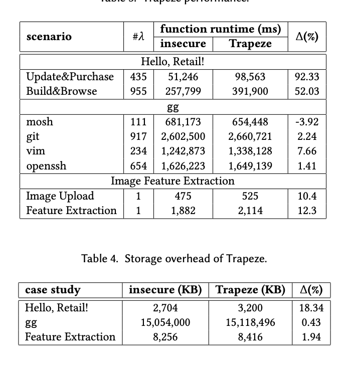

# Kappa #
## Introduction
Serverless computing is a new cloud model, where instead of virtual machines, tenants register event handlers (ex: python functions). This paper introduces Kappa, a "programming framework for general-purpose, parallel severless applications". Kappa's goal is to make a serverless developer's job a similar to any other parallel programmer's as possible.

## Motivation
* The authors argue that using lambda functions over VMs could be beneficial because lambda functions boot faster, thus are more scalable.
* The paper sites two main challenges in developing general -purpose parallel applications, which motivated them to create Kappa.
  
  (1) "programmers must manually partition their computation to fit within the lambda function time limit."
  
  (2) "programmers have no concurrency or synchronization primitives at their disposal, and so must either implement such primitives, restrict themselves to use share-nothing parallelism, or eschew the use of parallel lambdas." 

## Approaches

* **Checkpointing.**: Kappa checkpoints program state periodically and restores from this checkpoint upon lambda function timeout.
* **Concurrency API.** Kappa provides a concurrency API which enables users to program parallel lambdas, and supports spawning tasks, waiting on futures, and passing messages, it is also modeled after Python’s built-in multiprocessing package, so that it may be familiar to users.
* **Fault tolerance.**: "Kappa ensures that execution never diverges due to nondeterminism, and that any side effects invoked within the system are never re-executed in face of arbitrary lambda function timeouts."
* Kappa allows general applications to run on existing serverless offerings --> The authors describe this as the main contribution of their work.mputing.

## Trade-Offs
* Lambda functions are time-bounded --> they might not complete a task of arbitrary length.
* no similar concurrency API is provided by current serverless platforms
* Checkpointing in Kappa is fast --> applications can afford to checkpoint frequently.
* Below is a chart from the paper with comparisons between Kappa and other services. 
  

## Open Questions and Future Work
* They authors mention including featuries Kappa currenty lacks that previous systems have such as: 
  * RPC pipelining
  * dependency inference
  * workflow visualization 

# NumPyWren
## Introduction
The authors sought to discover the limitations of a disaggregated programming model, and believe dense linear algebra could reap maximal benefits from switching from a server-centric model to a disaggregated model. They built NumPyWren: "a system for linear algebra built on a disaggregated serverless programming model, and LAmbdaPACK, a companion domain specifc language designed for serverless execution of highly parallel linear algebra algorithms."

## Motivation
* Cloud providors have been pushing for datacenter disaggregation, meaning they are decoupling resources such as CPU, RAM, and SSD. This enables:
  * the datacenter operators may perform efficient bin-packing, while maintain high utilization despite of application logic.
  *  the application designer the ability to provision and deprovision resources on demand during application runtime
  *  the technology for different resources to evolve independently. 

* Current distributed programming abstractions require integrated resources, thus the datacenter operator must expose a new programming abstraction.
  * As a direct consequence, serverless platforms are mostly used for simple event-driven applications like IoT automation, front-end web serving, and log processing
* To understand if complex communication patterns and workloads can be efficiently fit in a serverless application, the authors study dense linear algebra an area of study they believe to be maximally benefitting form serverless computing. 

## Approaches

*  NumPyWren is designed to target linear algebra workloads
that have execution patterns similar to Cholesky decomposition as shown. 
* **NumpyWren** 
  * Every worker recieves a global dependency graph describing the control flow of the program. Each worker then locally figures out its dependencies based on its current position in the global task graph.
* **Programming Model**
  * The authors design LAmbdaPACK to adapt ideas from recent advances in the numerical linear algebra community on expressing algorithms as directed acyclic graph (DAG) based computation.
  * LAmbdaPACK is designed to allow users express tiled linear algebra algorithms, which express their computations as operations on matrix tiles, small submatrices that can fit in local memory.
  *  The main distinction between tiled algorithms and the classical algorithms found in libraries like ScaLAPACK is that the algorithm itself is agnostic to machine layout, connectivity, etc., and only defines a computational graph on the block indices of the matrices.

* **System Design**
  

**Task Enqueue**: The client process enqueues the first task that needs to be executed into the task queue. 
   * The task queue is a publish-subscribe style queue that contains all the nodes in the DAG whose input dependencies have been met and are ready to execute.

**Executor Provisioning:** The length of the task queue is
monitored by a provisioner that manages compute resources
to match the dynamic parallelism during execution. 

  * After the first task is enqueued, the provisioner launches an executor,and maintains the number of active executors based on task queue size. 
  
  * As the provisioner’s role is only lightweight it can also be executed periodically as a “serverless" cloud function.

**Task Execution:** Executors manage executing and scheduling NumPyWren tasks. 
* Once an executor is ready, it polls the task queue to fetch a task available and executes the instructions encoded in the task.
* The object store is assumed to be a distributed, persistent storage system that supports read-after-write consistency for individual keys. 
* Using a persistent object store with a single static assignment language is helpful in designing our fault tolerance protocol. 
* Executors self terminate when they near the runtime limit imposed by many serverless systems (900s for AWS Lambda).
*  The provisioner is then left in charge of launching new workers if necessary. 

**Runtime State Update:** Once the task execution is complete and the output has been persisted, the executor updates the task status in the runtime state store. 
* The runtime state store tracks the control state of the entire execution and needs to support fast, atomic updates for each task. 
* If a completed task has children that are “ready" to be executed the executor adds the child tasks to the task queue. 
* The atomicity of the state store guarantees every child will be scheduled. 
* The authors emphasize that they only need transactional semantics within the runtime state store, not the runtime state store and the child task enqueuing to occur atomically.

## Tradeoffs
"We evaluate NumPyWren on 4 linear algebra algorithms
Matrix Multiply (GEMM), QR Decomposition (QR) , Singular Value Decomposition (SVD) 2 and Cholesky Decomposition (Cholesky). All of the algorithms have computational
complexity of $O(N^3)$ but differ in their data access patterns."
* Below is a chart from the paper that displays the performance difference between the systems:
  

## Open Questions and Future Work

* Efforts that add fault tolerance to ScaLAPACK are currently causing significant performance overhead.
* NumPyWren opens up research for applications that have long been dominated by traditional HPC.

# Serverless IFC
## Introduction
The rise of serverless computing provides an opportunity to rethink cloud security. We present an approach
for securing serverless systems using a novel form of dynamic information flow control (IFC). We show that in serverless applications, the termination channel found in most existing IFC systems
can be arbitrarily amplified via multiple concurrent requests, necessitating a stronger termination-sensitive
non-interference guarantee, which we achieve using a combination of static labeling of serverless processes
and dynamic faceted labeling of persistent data.

## Motivation
In 2017 a there was a series of high-profile attacks on clouds, which compromised data of hundreds of millions of users.  Most of these attacks can be traced down to two types of faults:
1. misconfigurations 
   * this includes issues such as incorrect database security attributes, he choice of weak authentication schemes, or the use of unpatched software
2. software vulnerabilities.
   * This includes code and SQL injections, file inclusions, directory traversals.

The authors propose the use of information flow control (IFC)-based security to solve these issues. This would mean a global security policy would be used that cannot be overridden by misconfigured applications. This differs from security models based on access control or capabilities, in that a compromised program running with database administrator privileges can easily leak the entire
database to a remote attacker.

## Approaches
### Below are the initial assumptions amde my the authors on trustworthiness: ###

The authors assume that the following entities are trusted: 

1.  the cloud operator
2.  physical hosts and network
3.  system software (OS, hypervisor, container manager,
scheduler)
4. serverless runtime
5.  shared data stores
6.  the sandboxing technology. 

They also trust the serverless application administrator to enforce the following invariants on application configuration: 
1.  all data stores used by the application are configured to only be accessible from serverless functions
2.  all serverless functions in the system are sandboxed.

Finally, we trust the application developer to correctly define the application’s information flow
policy and declassifier functions (Section 6.2).
**The rest of the application is untrusted**

The IFC model begins by constructing the lattice of security labels, which represent security classes of information flowing through the system. Trapeze applies information flow rules outlined below to enforce that information received through an input channel labeled $l_i$ can only be exposed
through an output channel labeled $l_o$ if $l_i$ ⊑ $l_o$ . The below are directly from the paper:

1. Trapeze assigns a runtime security label to every serverless function activation. ( The function’s label controls its ability to send to an
output channel: a send is only allowed if the function’s label is smaller than or equal to the channel
label.)
2. Trapeze also dynamically labels records in the data store. To this end, the security shim intercepts
data store operations issued by the function and modifies them to insert and check security labels.
3. A function can upgrade its label to an arbitrary higher label using the raiseLabel operation. This
operation does not introduce an unauthorized information channel, as the decision to upgrade
cannot depend on secrets above function’s previous label (such secrets are simply invisible to the
function). The upgrade mechanism is useful, for example, when a function running on behalf of
a regular user needs to update global statistics on behalf of a superuser. Upgrade is a one-way
operation: a function’s label can never be downgraded below its current value.
4. Store semantics Trapeze’s security shim conceals the existence of data whose security label is
not less than or equal to the function’s label. Maintaining this semantics is straightforward when
all writes to a data store location carry the same label. Writes with conflicting labels, on the other
hand, may introduce implicit storage channels, where the attacker infers secrets by observing that
labeled values exist within particular store locations without observing the actual values

## Tradeoffs
"We measure the overhead of Trapeze by running case studies 1 and 3 on the AWS Lambda serverless platform. We run case study 2 on the OpenWhisk platform in the IBM Cloud (formerly, IBM Bluemix), since AWS Lambda does not support ptrace, which we use to sandbox binary executables in `gg`."

* Below is  atable representing the results from above experiments.

## Open Questions and Future Work
The authors mention that many researchers advocate the use of IFC in the broader context of secure cloud computing, but admmit they do not know a practical implementation of that idea. They also mention that they do not address covert timing channels.

Sources: 

[1] [Kappa](https://cs.nyu.edu/~apanda/assets/papers/metalmind-socc2020.pdf)

[2] [NumPyWren](https://cs.nyu.edu/~apanda/classes/sp21/papers/numpywren.pdf)

[3] [Serverless IFC](https://cs.nyu.edu/~apanda/classes/sp21/papers/serverless-ifc.pdf)
